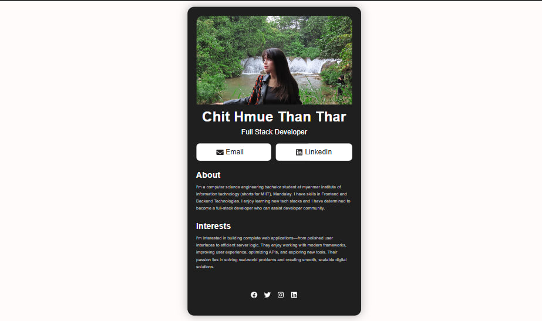

# Digital-Business-Card

I built **a Digital Business Card** as a simple, interactive website using React.js. The project showcases my **profile, contact information, and social media links** in a easy-to-use interface. Users can email me and view some formation about me, and interests quickly.

## Technology Used

React + Vite

## Requirements

Make sure you have the following installed before starting:

- Node.js >= 22.x

```bash
    node --version
    v22.20.0
```

- npm >= 11.x

```bash
    npm --version
    10.9.3
```

## Getting Started

### Create React Project With Vite

```bash
    npm create vite Digital-Business-Card
```

### npm install

```bash
    cd Digital-Business-Card
    npm install
```

### Run the app

Development mode:

```bash
    npm run dev
```

## Key Features:

- Good design layout for a simple business card
- Simple, clean, and user-friendly interface
- Built with React for a smooth, component-based structure
- Simple, clean, and user-friendly interface

## Project Preview


